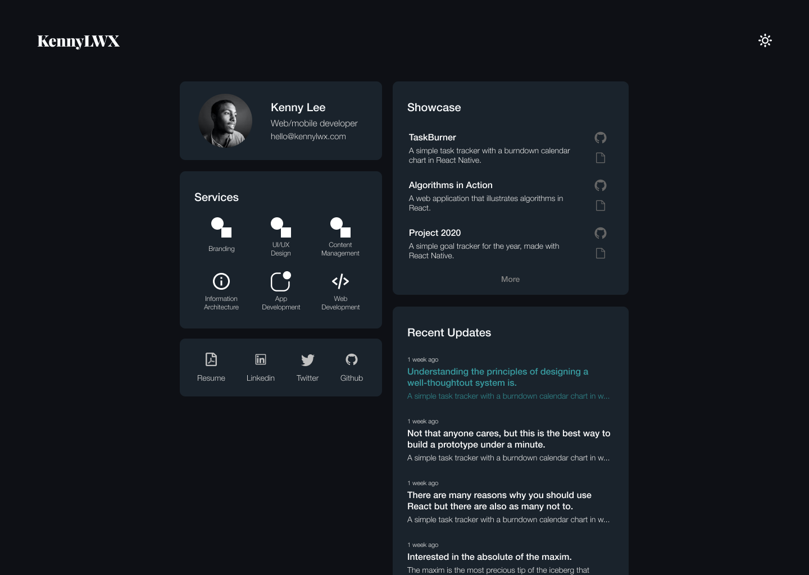
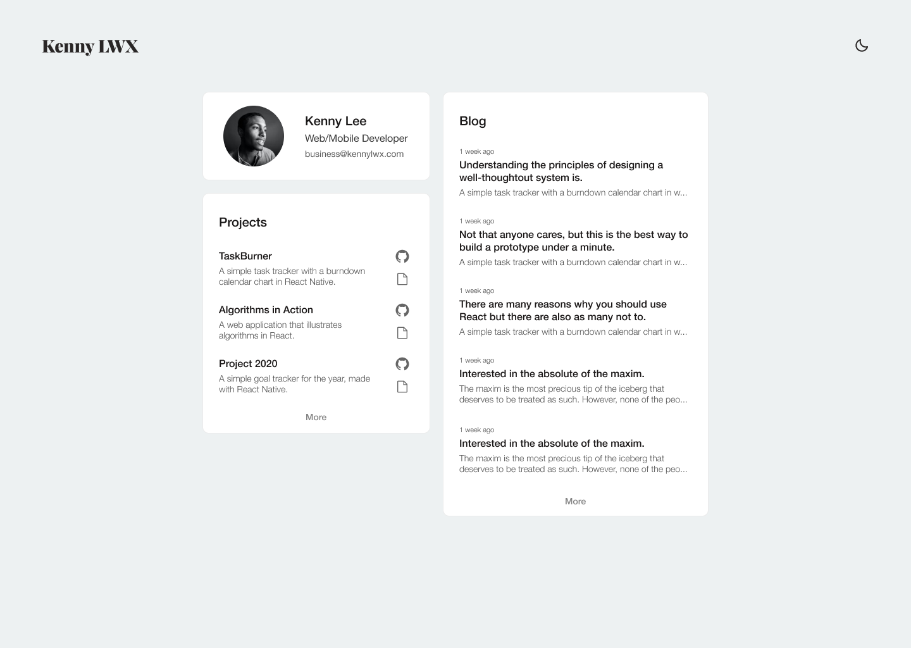

After spending more than four years in school, I had the sudden realisation that I had nothing to show for it. Yes, I have the diploma that comes along with it, but in terms of actual project that you can link your prospective employers to, none. So I took it upon myself, to build something. And I knew just the right one to start with. A portfolio website, that ideally, would house all my future works.

## Finding the right inspiration

Before starting, I first had to seek out some inspiration. Most of the design studio that I found on Google were all too flashy for my liking. I understand that impressions matter, but I couldn't bear spending another week perfecting the designs and never get anywhere to building it. Luckily, tucked away in my bookmark, was a [blog by Jane Manchun Wong](https://wongmjane.com). I kept it there, because a few months back, I was admiring her simplistic and straightforward design, and thought it would be handy someday. Guess I was right.

I quickly drew up my designs with Figma. The easiest part of the design was drafting up the types of information and how I wanted it to be displayed. I arranged it in a way that all of the high level information is present in the home page. I didn't want any unneccessary scrolling nor routing to different pages, because I felt the user experience was too cumbersome. In hindsight, I believe this was only possible, as I didn't have much of a story to tell.

The details of the 5 different sections.

1. Profile (my personal detail).
2. Services (my area of focus).
3. Socials (my online presence).
4. Showcase (my project highlights).
5. Updates (my recent blog posts).

### Colours are hard

The hardest part of the design work were the colours. I wanted my portfolio to have a dark and light theme, just like Jane. Designing the light theme was easy, however, finding the right colours for the dark theme was unexpectedly harder than I thought. Most of the colours I chose fell flat, and didn't really harbour the appeal that I was looking for. However, as night was about to turn to day, I settled on teal being the dark colour theme.

#### Mockups with Figma

## Building with GatsbyJS

Prior to this, I had no experience using GatsbyJS. My initial intention was to build the website with React. I hadn't even heard of GatsbyJS until the day before when I was scrolling through Ben Awad's video on [when should you use Gatsby?](https://www.youtube.com/watch?v=VoscwJ6MGsU). Thinkering with the idea, I decided to give GatsbyJS a shot, with the crash course prepared by [TraversyMedia](https://www.youtube.com/watch?v=6YhqQ2ZW1sc). After an hour long following Brad, I found GatsbyJS simple and easy. It met all of my requirements. However, I was apprehensive about using graphql, but nevertheless I powered through. I figured it'll eventually work out by itself.

Most of my time was spent on building React components, and dressing it up with raw HTML and CSS. And when the time came that I had to query some data using graphql, I found it pleasantly effortless. The tool GraphiQL that came with GatsbyJS really made visualising the dataset and the query effortless.

### Portfolio, blog, is there a difference?

As I start to move on to the showcase and updates section, I quickly realise that they are one of the same. My initial thoughts were, I would have a section just for projects, and another just for blog posts. However, I can't actually house a project in my website. At best, I could snap some screenshot, and put a link somewhere. Somehow, that thought didn't occur to me. So I pivoted and made some changes.

4. Showcase (~~my project highlights~~ features eye-worthy blog posts).
5. Updates (~~my recent blog posts~~ recently published blog posts).

What was once a portfolio site has turned into a blog site. It didn't matter as much since all the projects that I would work on should have an accompanying blog post like this one. And I could use tags to differentiate them. This feature definitely needs further refinement. However, since Monday was approaching, I had to move on.

### Theme switching

For most of my projects, I used Sass, because of its versatility in comparison to CSS. However, when I had to implement a theme switcher, it turns out that I couldn't do it with Sass. What happen was, after compiling the sass files, you can no longer dynamically edit the sass variables, as all the files marked as sass turns into regular css. The only way forward was to use CSS variables.

To allow the users to switch between the themes, I used the plugin `gatsby-plugin-darkmode`, which uses Redux to store the current state. This was handy as you wouldn't have to pick the right theme each time you refresh the page.

I thought about creating some animation where the moon falls while the sun rises as the user toggles the theme switcher. However, I quickly abandon that idea, since it would take me more than a few days to learn how to do so. Also, all the web applications that provided css animation services were unattractively hard to use.

### Changing Favicon

My experience with React in altering the icons were much smoother than GatsbyJS. All I had to do was replace every icon in the public folder of my React project. However, when it came to Gatsby,I found out that the public folder was procedurally generated each time I run `develop`. This meant that, all I had to do was point to the image that I would like to set as the application's icon in the configuration page. I was impress sure, but things didn't go as smooth. Although the icons were displaying correctly, in chromium browsers, it was not in Safari. The Gatsby icon still persists even though I had deleted it, and editing the configuration file as per github issues. I can only hope for it to be rectify in the coming days.

## Deploying with Netlify

Before starting the project, I had already purchased a domain name from Google Domains. It was cheap and easy. I deployed the project that I had worked on from the crash course to Netlify. All I had to do was point my google domain name servers to my project's on Netlify. It took 2 days before I could actually see the actual web page hosted on my domain name. Although quite confusing with its directives, my experience with Netlify and a Google Domains was a welcomed one.

## Aftermath

All in all, it took less than a week of my time from start to finish to complete this [project](https://kennylwx.com/). There were definitely changes that needed to be made. For instance, the profile section didn't feature much of a story of the author. And the service section felt lacking in telling it. Another drawback on the design was that it's almost entirely textual base. A section that features images would be desirable, but would also terribly unabalance the overall aesthetics.

There were definitely ups and downs in building this projects, but overall, the experience was a somewhat pleasant one. **6.5/10** would recommend only if you have to.
